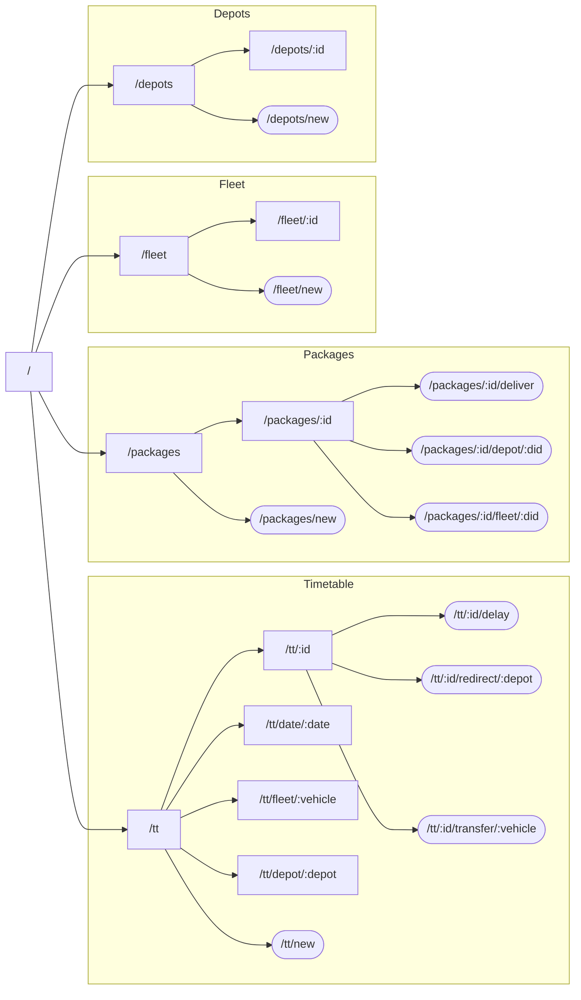

# Backend API Documentation
This documentation explains how to utilize the REST API for the backend.

# Launching
To run locally, install some flavor of Java 11, as well as SBT. You can launch the API using:
```shell
sbt run
```

To run within Docker (easier), use the following to build:
```shell
docker build -t backend .
```
Then the following to run:
```shell
docker run -d -p "9000:9000" backend
```
Using Docker-Compose is preferable because it handles ports automatically and will network the backend container with
the Postgres database.

# Request types
For any request to read resources, you use `GET` requests. For anything where you add or modify resources, use `POST`
requests, where the body contains the content as a JSON object.

# Tree
Rectangles are `GET` requests, rounded are `POST` requests.<br />
Any item that begins with `:` is a variable. For example, `:id` is the variable "id". These parameters will be
documented below.
